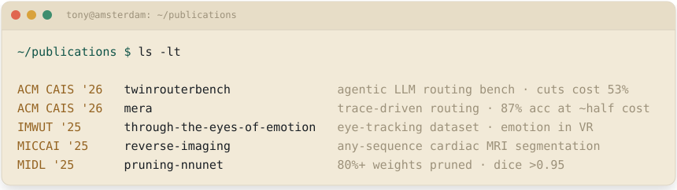
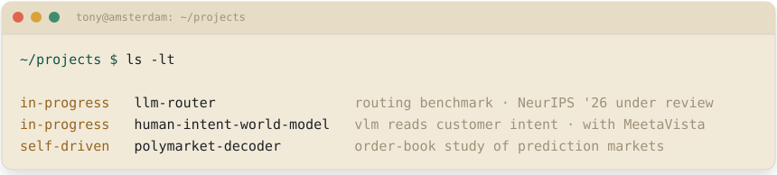
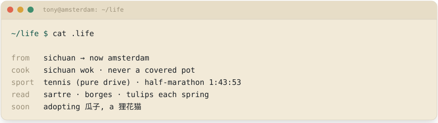
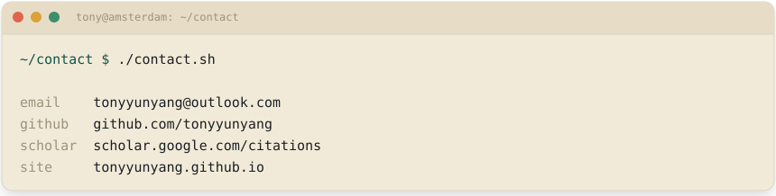

<!-- Hand-built terminal-session profile. The panes are generated by
     scripts/build-panes.mjs from content/profile.json. The ~/log pane is
     regenerated twice daily by .github/workflows/studio.yml. Do not hand-edit
     the SVGs; edit content/profile.json and rerun `npm run build:panes`. -->

  <picture>
    <source media="(prefers-color-scheme: dark)" srcset="./assets/hero-dark.svg">
    
  </picture>

  
  
  
  
  

  <picture>
    <source media="(prefers-color-scheme: dark)" srcset="./assets/publications-dark.svg">
    
  </picture>

  
  
  
  &nbsp;
  
  
   
  
  
  
  &nbsp;
  
  
   
  
  

  <picture>
    <source media="(prefers-color-scheme: dark)" srcset="./assets/projects-dark.svg">
    
  </picture>

  

  <picture>
    <source media="(prefers-color-scheme: dark)" srcset="./assets/stack-dark.svg">
    
  </picture>

  <picture>
    <source media="(prefers-color-scheme: dark)" srcset="https://raw.githubusercontent.com/tonyyunyang/tonyyunyang/output/ledger-dark.svg">
    
  </picture>

  <picture>
    <source media="(prefers-color-scheme: dark)" srcset="./assets/life-dark.svg">
    
  </picture>

  <picture>
    <source media="(prefers-color-scheme: dark)" srcset="./assets/contact-dark.svg">
    
  </picture>

  
  
  
  

plain text (for screen readers and search)

Tony (Tongyun) Yang, Independent AI Researcher in Amsterdam. The scaling race is becoming a systems race; bigger models still matter, but they are not enough; what counts is how we train, route, compress, and ship them. Left my PhD fellowship this spring; open to research roles in academia or industry.

Publications: TwinRouterBench (ACM CAIS 2026), MERA (ACM CAIS 2026), Through the Eyes of Emotion (IMWUT 2025), Reverse Imaging (MICCAI 2025 and IEEE TMI), Pruning nnU-Net (MIDL 2025).

Projects: LLM Router (routing benchmark with Gradient Networks, under review at NeurIPS 2026), Human Intent World Model (vision-language model for customer intent, with MeetaVista), Polymarket Decoder (self-driven order-book study of prediction markets).

Stack: python, pytorch, cuda, latex; claude code, codex, cursor, a custom harness, pi-agent, harness; vllm, sglang, ray, deepspeed; tensorflow, unity, typescript, c++, linux; react, node, docker, git.

Contact: tonyyunyang@outlook.com, github.com/tonyyunyang, scholar.google.com, tonyyunyang.github.io.

hand-built, no template ancestry · companion to tonyyunyang.github.io

