<!--
  ┌──────────────────────────────────────────────────────────────────────┐
  │  PLATE GH · STUDIO                                  AMSTERDAM · 2026 │
  │                                                                      │
  │     Tony Yang  杨童耘                                                 │
  │     INDEPENDENT AI RESEARCHER · AMSTERDAM                            │
  │                                                                      │
  │     ~~~~~~~~~~~                                                      │
  │     building useful, durable AI                                      │
  │                                                                      │
  │  § N° 01 · IDENTITY                                and we tinker.    │
  └──────────────────────────────────────────────────────────────────────┘
  Hand-built, no template ancestry. Companion to https://tonyyunyang.github.io.
-->

<!-- ============================================================
     HERO BANNER · light/dark adaptive via <picture>
     ============================================================ -->

  <picture>
    <source media="(prefers-color-scheme: dark)" srcset="./assets/banner-dark.svg">
    <source media="(prefers-color-scheme: light)" srcset="./assets/banner-light.svg">
    
  </picture>

<!-- ============================================================
     QUICK LINKS · light, editorial flat-square pills
     ============================================================ -->

  
  
  
  
  

  <picture>
    <source media="(prefers-color-scheme: dark)" srcset="./assets/ornament-dark.svg">
    <source media="(prefers-color-scheme: light)" srcset="./assets/ornament-light.svg">
    
  </picture>

<!-- ============================================================
     §00 · CURRENTLY · what I'm doing right now
     ============================================================ -->

## §00 · Currently

<table>
<tr>
<td valign="top" width="62%">

An independent AI researcher in Amsterdam. I work with industry partners (Tencent, Gradient Networks, MeetaVista) and academic groups (TU Delft, McGill, Tsinghua). Three threads run through what I do. Cost efficient large language models. Optimization as reasoning. World models that read intent.

Before Amsterdam I was a Marie Skłodowska-Curie Fellow at IMDEA Networks in Madrid. Before that, a Research Engineer at TU Delft Imaging Physics. My MSc is from TU Delft, in Computer and Embedded Systems Engineering.

Mostly I want to build AI that is useful, that holds up, and that reaches the people who need it.

</td>
<td valign="top" width="38%" align="right">

<i>Open to collaborations, PhD opportunities, and research roles. Either side, academia or industry.</i>

</td>
</tr>
</table>

<!-- Locator plate · single line route, current city marked. Replaces
     the table-cell location list that used to wrap awkwardly onto two
     lines and never made the current city obvious. -->

  <picture>
    <source media="(prefers-color-scheme: dark)" srcset="./assets/locator-dark.svg">
    <source media="(prefers-color-scheme: light)" srcset="./assets/locator-light.svg">
    
  </picture>

  <picture>
    <source media="(prefers-color-scheme: dark)" srcset="./assets/ornament-dark.svg">
    <source media="(prefers-color-scheme: light)" srcset="./assets/ornament-light.svg">
    
  </picture>

<!-- ============================================================
     §01 · RESEARCH · featured papers as rich cards
     ============================================================ -->

## §01 · Research

<table>
<tr>
<td valign="top" width="50%">

### Through the Eyes of Emotion · IMWUT '25

A multifaceted eye tracking dataset for emotion recognition in VR. Periocular video at 120 fps. Gaze at 240 Hz. 26 participants across Ekman's seven basic emotions.

<i>The first dataset with high frame rate periocular videos. Four times the gaze frequency of prior work. Open Unity collection and Label Studio annotation tools, all included.</i>

**Tongyun Yang**†, Bishwas Regmi†, Lingyu Du, Andreas Bulling, Xucong Zhang, Guohao Lan

</td>
<td valign="top" width="50%">

### Pruning nnU-Net · MIDL '25

Over 80% of weights in trained nnU-Net models can be removed via simple magnitude based pruning. Proxy Dice stays above 0.95 across multiple medical segmentation tasks.

<i>Validated on four medical datasets, both 2D and 3D. Critical weights cluster near the encoder and decoder ends. Bottlenecks turn out to be heavily prunable.</i>

**Tongyun Yang**, Yidong Zhao, Qian Tao

</td>
</tr>
</table>

<b>§01b · Other publications</b> &nbsp; <i>(click to unfold)</i>

 

| Paper | Venue | Links |
|-------|-------|-------|
| **Reverse Imaging: Any-Sequence Generalization for Cardiac MRI Segmentation** | MICCAI 2025 & IEEE TMI | [Paper](https://papers.miccai.org/miccai-2025/0780-Paper2605.html) · [Code](https://github.com/Ido-zh/cmr_reverse) |

 

### §01c · Research compass

<i>Two threads run through every paper here. Pushing AI beyond text, into perception and action. Making those systems fairer and easier to reach in practice.</i>

<table>
<tr>
<td valign="top" width="33%">

**🜨&nbsp; World models**
 Systems that perceive a scene and imagine what happens next. The bridge from describing the world to acting in it.

</td>
<td valign="top" width="33%">

**◉&nbsp; Large language models**
 Making capable models cheap, dependable, and useful enough to actually deploy. Routing, optimization, agent design.

</td>
<td valign="top" width="33%">

**◐&nbsp; Computer vision**
 Vision as a channel for human signal, not just object detection. Reading emotion, intent, attention from what people see.

</td>
</tr>
<tr>
<td valign="top">

**♥&nbsp; AI for medicine**
 Models that work in the real clinic, not only on the leaderboard. Smaller, faster, and fair across patient populations.

</td>
<td valign="top">

**⛨&nbsp; AI safety**
 Building things that behave reliably when they leave the lab. Robustness, evaluation, the unglamorous work of trust.

</td>
<td valign="top">

**⌂&nbsp; Fairness × access**
 A motivation, not a separate field. Anything I build should reach the people who need it most, not the people who already have everything.

</td>
</tr>
</table>

  <picture>
    <source media="(prefers-color-scheme: dark)" srcset="./assets/ornament-dark.svg">
    <source media="(prefers-color-scheme: light)" srcset="./assets/ornament-light.svg">
    
  </picture>

<!-- ============================================================
     §02 · STACK · hand-drawn workshop kit plate
     Replaces the shields.io brand-pill grid (which read as a logo
     parade in three sizes) with a single editorial plate showing
     line-art icons and frequency tiers in the exact site palette.
     ============================================================ -->

## §02 · Stack

  <picture>
    <source media="(prefers-color-scheme: dark)" srcset="./assets/stack-dark.svg">
    <source media="(prefers-color-scheme: light)" srcset="./assets/stack-light.svg">
    
  </picture>

  <picture>
    <source media="(prefers-color-scheme: dark)" srcset="./assets/ornament-dark.svg">
    <source media="(prefers-color-scheme: light)" srcset="./assets/ornament-light.svg">
    
  </picture>

<!-- ============================================================
     §03 · OPEN THE WORKSHOP · single comprehensive ledger plate
     Combines figures, 30-day sparkline, and a full 53-week year grid
     into one composition. Replaces the prior ledger + Platane/snk
     snake pair. The snake step is removed from the workflow.
     ============================================================ -->

## §03 · Open the workshop

  <picture>
    <source media="(prefers-color-scheme: dark)" srcset="https://raw.githubusercontent.com/tonyyunyang/tonyyunyang/output/ledger-dark.svg">
    
  </picture>

<i>Regenerated twice a day. The figures move, the workshop stays open.</i>

  <picture>
    <source media="(prefers-color-scheme: dark)" srcset="./assets/ornament-dark.svg">
    <source media="(prefers-color-scheme: light)" srcset="./assets/ornament-light.svg">
    
  </picture>

<!-- ============================================================
     §04 · OFF THE PAGE · personality
     ============================================================ -->

## §04 · Off the page

<table>
<tr>
<td valign="top" width="50%">

> Originally from **Sichuan**. Now in **Amsterdam**, by the canals.
> Cooks Sichuan in a wok at home. Dried chilis, garlic, peppercorns. Never a covered pot.

> Plays **tennis** with a Babolat Pure Drive (his wife uses a Wilson Blade).
> Half marathon PB **1:43:53**. Aiming for sub 1:40.

</td>
<td valign="top" width="50%">

> Reads **Sartre** and the **Boom Latinoamericano** (Borges).
> Buys **tulips at the Bloemenmarkt** every spring.

> Planning to adopt **瓜子**, a 狸花猫 (Chinese mackerel tabby).
> Writes longhand with a **fountain pen** before any keyboard gets involved.

</td>
</tr>
</table>

<i>For more, step into the <a href="https://tonyyunyang.github.io/world/">Studio</a>. A hand-drawn cross-section of the room.</i>

  <picture>
    <source media="(prefers-color-scheme: dark)" srcset="./assets/ornament-dark.svg">
    <source media="(prefers-color-scheme: light)" srcset="./assets/ornament-light.svg">
    
  </picture>

<!-- ============================================================
     §05 · CONNECT
     ============================================================ -->

## §05 · Connect

<table>
<tr>
<td valign="top" width="60%">

I read every message. The fastest way to reach me is **email**. The personal site has more research context if you want it.

For collaborations, PhD opportunities, or research roles in academia or industry, the door is open.

</td>
<td valign="top" width="40%" align="right">

 

 

 

</td>
</tr>
</table>

<!-- ============================================================
     FOOTER · italic margin annotation, plate colophon
     ============================================================ -->

 

  <picture>
    <source media="(prefers-color-scheme: dark)" srcset="./assets/ornament-dark.svg">
    <source media="(prefers-color-scheme: light)" srcset="./assets/ornament-light.svg">
    
  </picture>

  <i>Built across LLMs, vision, world models, and clinical AI.</i>
   
  PLATE GH · STUDIO · 2026 · AMSTERDAM

  

